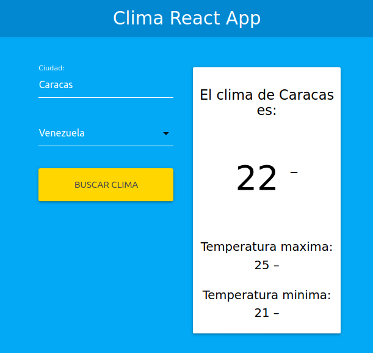

<!DOCTYPE html>
<html lang="en">
<head>
  <title></title>
  <meta charset="utf-8">
  <meta name="viewport" content="width=device-width, initial-scale=1">
  <link rel="stylesheet" href="https://maxcdn.bootstrapcdn.com/bootstrap/3.4.1/css/bootstrap.min.css">
  
  
</head>
<body>

  

    <h1>Clima React</h1>      
    
Aplicación realizada en React implementando los hooks para el uso representativo de los states.

      
  
    

</body>
</html>